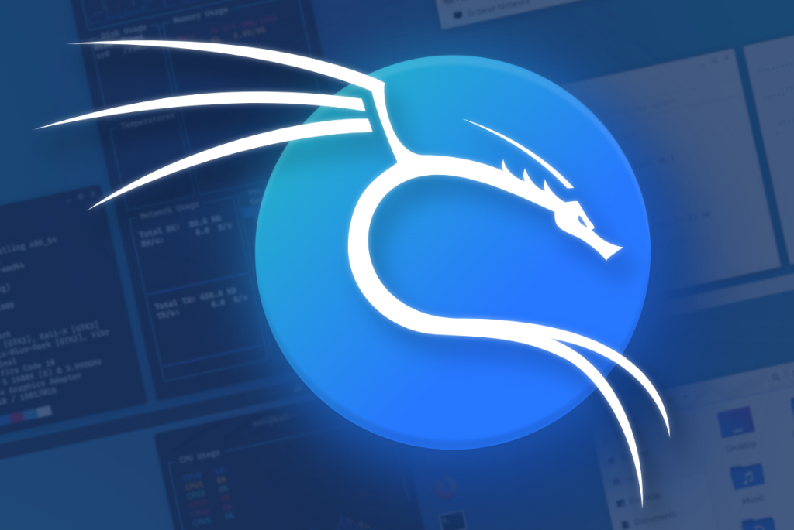

# Setting Up a Home Lab for Cybersecurity Training with Elastic SIEM and Kali Linux

In the world of cybersecurity, staying ahead of potential threats is paramount. Understanding the tools and techniques used in security monitoring and incident response is crucial for safeguarding systems and data against malicious actors. In this blog post, I will provide a walk-through outlining how I set up a home lab using Elastic SIEM and a Kali VM, which enabled me to gain hands-on experience with security monitoring and incident detection.

## Setting Up Elastic SIEM

To start, it’s essential to create a free Elastic account to deploy a cloud-based Elastic instance for running the SIEM. You can do this by navigating to [Elastic Cloud](https://cloud.elastic.co/registration). Upon logging in, locate and click on the “Start your free trial” option. Next, select the “Create Deployment” button, and opt for “Elasticsearch” as the deployment type. Choose a region and deployment size that aligns with your requirements, and proceed by clicking on the “Create Deployment” button. Once the deployment setup is finalized, click on “continue” to proceed with the next steps.

## Setting Up Kali Linux VM

The next step is setting up your Kali VM. For this, I used Oracle VirtualBox. Once VirtualBox is downloaded and set up on your machine, you can proceed with downloading the Kali Linux ISO image from the official Kali website. Choose the appropriate version based on your system architecture (32-bit or 64-bit).

To create a new virtual machine:

1. Launch VirtualBox and click on the “New” button in the toolbar.
2. Enter a name for your virtual machine (ex. “Kali”) and select the type as “Linux” and the version as “Debian (64-bit)”.
3. Allocate memory (RAM) to the virtual machine. A minimum of 2 GB is recommended for Kali Linux.
4. Create a virtual hard disk now and choose the default options for the hard disk file type and storage allocation.
5. Choose the hard disk file type. The default option (VDI) should suffice for most users.
6. Select “Dynamically allocated” for the storage on physical hard disk. This allows the virtual disk file to grow as needed.
7. Specify the size of the virtual hard disk. A minimum of 20 GB is recommended for installing Kali Linux.
8. Click “Create” to create the virtual machine.
9. Start the virtual machine by clicking on the “Start” button in VirtualBox.

Follow the on-screen instructions to install Kali Linux on the virtual hard disk. Once the installation is complete, reboot the virtual machine and log in to your new Kali Linux environment.

**Note:** If you are only using this VM for this lab, the recommended RAM and CPU requirements may be able to be lessened a bit.

## Setting Up Elastic Agent

Next, we must set up an agent. An agent refers to a software application installed on a device, such as a server or endpoint, with the purpose of gathering and transmitting data to a centralized system for analysis and monitoring. Within the realm of Elastic SIEM, an agent serves as a mechanism for retrieving and relaying security-related events from endpoints to the Elastic SIEM instance. To configure the agent for collecting logs from your Kali VM and transmitting them to your Elastic SIEM instance, adhere to the following steps:

1. Access your Elastic SIEM instance by logging in and proceeding to the Integrations page. You can do this by clicking on the hamburger menu bar located at the top left corner of the interface. From there, select “Add Integrations” which is located at the bottom of the menu.

2. Locate “Elastic Defend” and select it to access the integration page. Proceed to click on “Install Elastic Defend” and adhere to the instructions outlined on the integration page to install the agent on your Kali VM.
3. Select ‘Add Elastic Agents to your hosts’ and paste in the provided command to your Kali Linux terminal.
4. The installation could take a few minutes, but once it is complete you will see a command that says “Elastic Agent has been successfully installed.” The agent will now commence collecting and transmitting logs to your Elastic SIEM instance automatically.

## Generating Security Events

You can now generate some security events on your Kali VM by running an Nmap scan. Nmap is a freely available open-source tool utilized extensively for network exploration, administration, and security assessment purposes. Its primary function revolves around uncovering hosts and services within a computer network, essentially crafting a comprehensive “map” of the network landscape. Nmap’s capabilities extend to scanning hosts to identify accessible ports, discerning the operating system and software running on target systems, and procuring additional network-related information.

You can run an Nmap scan on your Kali machine by opening up the terminal and entering some of the following commands: 

- `nmap -p- localhost`
- `sudo nmap <vm-ip>`
- `nmap -sS <ip address>`
- `nmap -sT <ip address>`

## Querying and Analyzing Logs

Now that we have forwarded data from the Kali VM to the SIEM, we can start querying and analyzing the logs in the SIEM. To do this:

1. Click on the hamburger menu icon at the top-left and then under “Observability” select “Logs”.
2. In the search bar, search for all logs related to Nmap scans by entering the following query: `process.args: “nmap_scan”`.
3. The results of the search query will be displayed in the table. You can click on the three dots next to each event to view more details. By generating and scrutinizing various security events within Elastic SIEM, such as the one described above, you can enhance your comprehension of the detection, investigation, and response processes to security incidents in real-world scenarios.

## Creating Visualizations and Alerts

1. Click on the hamburger icon and select “Dashboards” under the “Analytics” section to create a new dashboard.
2. Click “Create dashboard” and then on the “Create Visualization” button to add a new visualization to the dashboard. Select “Bar chart” as the visualization type. For the Metrics section, select “Count” for the vertical field type and “Timestamp” for the horizontal field type. Click ‘Save’ to complete the visualization.
3. Next, click on “Alerts” under the “Security” section to create an alert. Click on “Manage Rules” and then “Create new rule”. Under the “Define rule” section, select the “Custom query” option and set the conditions for the rule (e.g., `event.action: “nmap_scan”`). Give your rule a name, description, and fill out the other relevant information required to help prioritize your alerts based on significance. Then click “Continue”.
4. In the “Actions” section, select the actions to be taken when an alert is triggered. Options include sending an email, Slack message, creating a Jira ticket, or triggering a custom webhook. Finally, select “Create and enable rule” to create the alert.

## Conclusion

In this comprehensive guide, we’ve crafted a home lab environment leveraging Elastic SIEM and a Kali VM. Throughout the process, we channeled data from the Kali VM to the SIEM via the Elastic Beats agent, generated simulated security events using Nmap, and thoroughly explored querying and analyzing logs within the SIEM through the intuitive Elastic web interface. Additionally, we’ve gone a step further by crafting a dynamic dashboard to visually represent security events, complemented by the creation of a tailored alert system to promptly detect security incidents.

This home lab served as an avenue for honing and refining my skills in security monitoring and incident response with Elastic SIEM. By immersing myself in this hands-on exercise, I have gained practical experience in utilizing a SIEM but also nurturing the expertise necessary to thrive as a proficient security analyst or engineer, and you can too!
